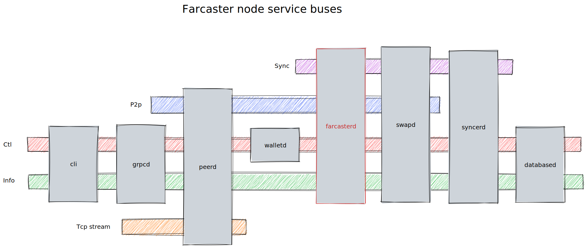

# Farcaster Node Diagrams

This folder contains a collection of diagrams describing node's components behaviour. Different formats are used: [sequencediagram.org](https://sequencediagram.org/), [excalidraw](https://excalidraw.com).

## [Services' message flow](./sequencediagram.txt)

This diagram presents the message flow between services during a swap execution.

## [Reconnect sequence](./reconnect_sequencediagram.txt)

This diagram presents the reconnection mechanism implemented for the peer-to-peer connections.

## [State recovery sequence](./staterecovery_sequencediagram.txt)

This diagram presents the state recovery mechanism. During a swap checkpoints are created, it is possible after a node restart to load the latest registered checkpoint for a given swap and recover its state.

## [Node busses design (excalidraw format)](./node-busses.excalidraw)

This diagram shows the busses used by the microservices to communicate and who is communicating on which one. (All microservices have access to all busses, but some do not listen for every one.)

