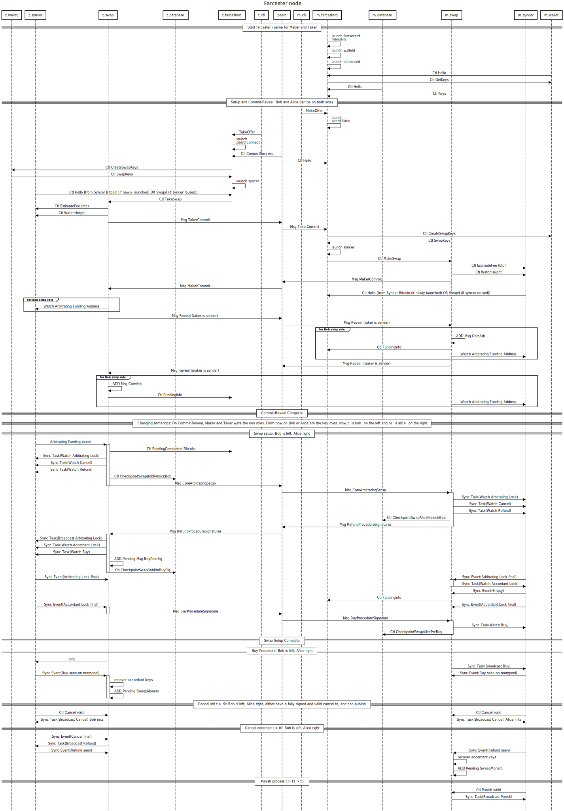
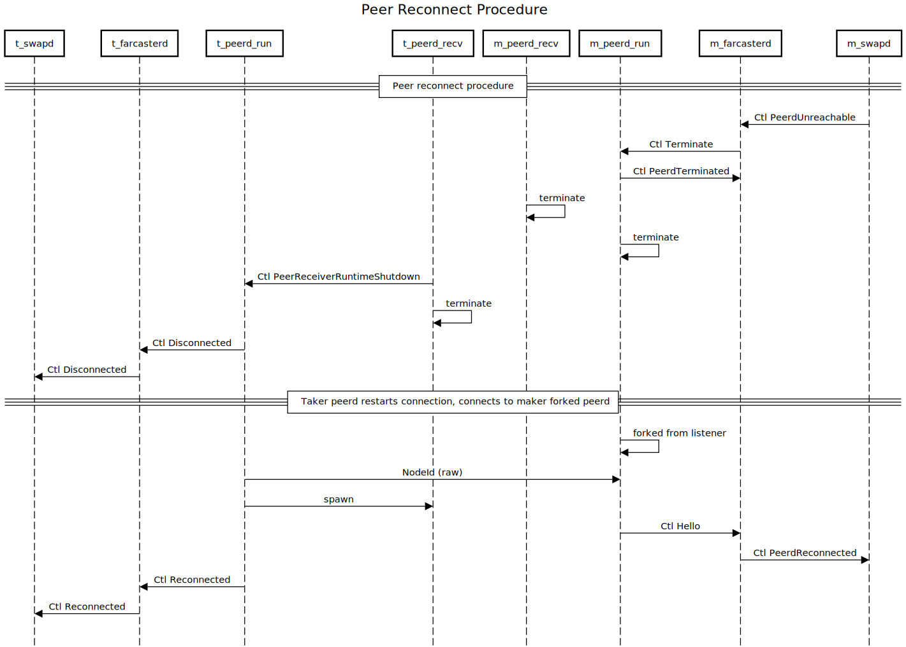
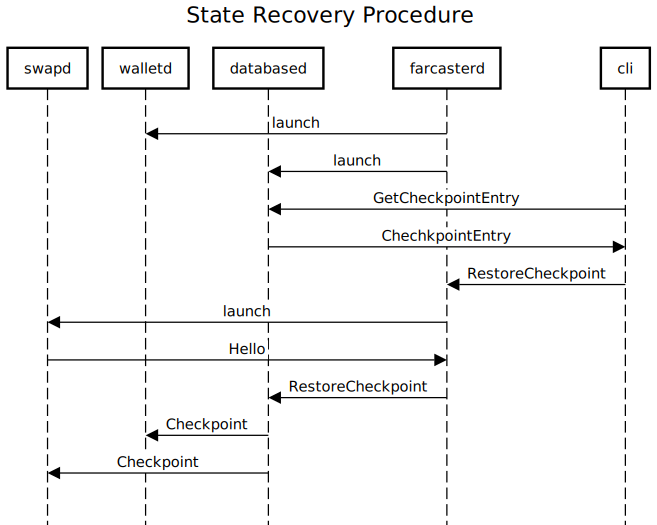

# Farcaster Node Diagrams

This folder contains a collection of diagrams describing node's components behaviour. Two formats are used: [sequencediagram.org](https://sequencediagram.org/) and [edotor.net](https://edotor.net/).

## [Services' message flow](./sequencediagram.txt)

This diagram presents the message flow between services during a swap execution.

## [Reconnect sequence](./reconnect_sequencediagram.txt)

This diagram presents the reconnection mechanism implemented for the peer-to-peer connections.

## [State recovery sequence](./staterecovery_sequencediagram.txt)

This diagram presents the state recovery mechanism. During a swap checkpoints are created, it is possible after a node restart to load the latest registered checkpoint for a given swap and recover its state.

## [State machine](./swap_state_machine.txt)

This diagram shows the states and transition messages of swapd state and can be edited with [edotor.net](https://edotor.net/).

